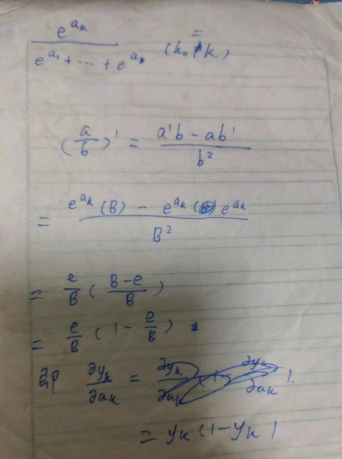
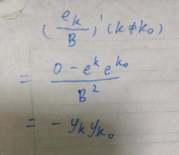
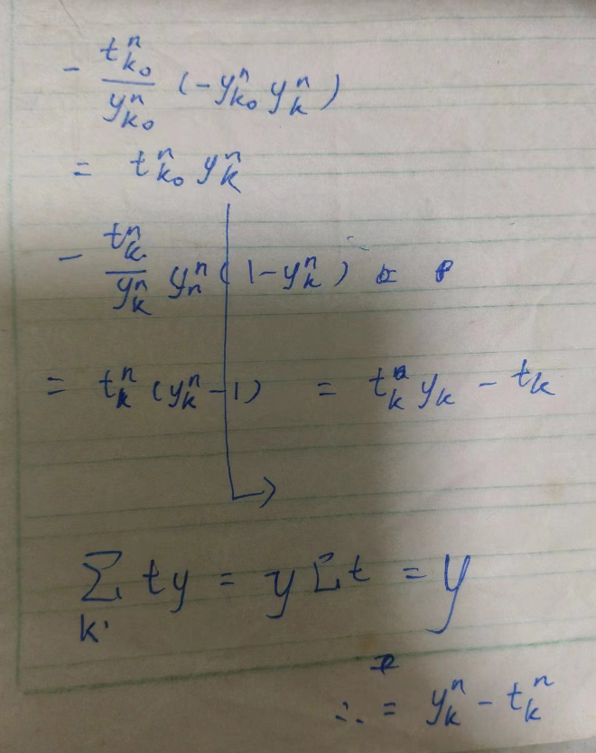

## 论文格式

在 overleaf 搜索到同款 neurlPS 的模板：[搜索页](https://www.overleaf.com/gallery?q=neurlPS) [结果页](https://www.overleaf.com/latex/templates/neurips-2023/vstgtvjwgdng)

初始模板会屏蔽作者，可以加 final 调库。

## perceptron

### a

$$
\mathbf w_{new}=w_{old}+\eta(y-\hat y)Aug(x)
$$


### b

激活函数定义为 $\ge0$ 时预测 $1$，否则预测 $0$。

训练参数视为 $Aug(x)=(1,x_1,x_2)$，对每个 $w_i$，分别用对应的 $x_i$ 更新。即：
$$
w_i+=\eta(teacher-output)Aug(x_i)
$$
output 为 $w_0+w_1 x_1+w_2 x_2$

故更新增量第一次为 $(0-1)(1,1,1)=(-1,-1,-1)$

第二次为 $(1-0)(1,0,0)=(1,0,0)$

第三次为 $(1-0)(1,0,1)=(1,0,1)$ 之后 $w=(1,-1,0)$


编写代码，找到一个可行的测试顺序：

```python
w = [0,0,0]
def f(x1,x2):
    teacher=int(not(x1 and x2))
    output=1 if w[0]+w[1]*x1+w[2]*x2>=0 else 0
    dt=teacher-output
    print(x1,x2,output,teacher,w[0],w[1],w[2])
    w[0]+=dt
    w[1]+=dt*x1
    w[2]+=dt*x2

train = ((0,0),(0,1),(1,0),(1,1))

def h():
    for x1, x2 in train:
        teacher=int(not(x1 and x2))
        output=1 if w[0]+w[1]*x1+w[2]*x2>=0 else 0
        if teacher!=output:
            return False
    return True

# 随机尝试，直到找到 OK 的

from random import choice
def g():
    global w
    while True:
        w = [0,0,0]
        t = [(1,1),(0,0),(0,1)] + [choice(train) for _ in range(7)]
        for x1, x2 in t:
            f(x1, x2)
        if not h():
            print('fail')
        else:
            print('ok')
            break
g()

# 绘图验证

import matplotlib.pyplot as plt
import numpy as np

def g(): # 分界线所在也是红色的
    c, a, b = w
    
    x = np.linspace(-1, 2, 400)
    y = np.linspace(-1, 2, 400)
    X, Y = np.meshgrid(x, y)

    Z = a*X + b*Y + c

    plt.figure(figsize=(6,6))
    plt.contourf(X, Y, Z, levels=[0, Z.max()], colors='red', alpha=0.3)

    points = {'(0,0)': (0, 0), '(0,1)': (0, 1), '(1,0)': (1, 0), '(1,1)': (1, 1)}
    for label, (x, y) in points.items():
        color = 'blue' if label == '(1,1)' else 'red'
        plt.scatter(x, y, color=color)
        plt.text(x, y, label, fontsize=12, horizontalalignment='right')

    plt.xlim(-1, 2)
    plt.ylim(-1, 2)
    plt.axhline(0, color='black',linewidth=0.5)
    plt.axvline(0, color='black',linewidth=0.5)
    plt.grid(color = 'gray', linestyle = '--', linewidth = 0.5)
    plt.title('Graph of ax + by + c >= 0 with specific points marked')
    plt.xlabel('x')
    plt.ylabel('y')
    plt.show()

g()
```

一个可行解为：

```
1 1 1 0 0 0 0
0 0 0 1 -1 -1 -1
0 1 0 1 0 -1 -1
1 1 1 0 1 -1 0
1 1 0 0 0 -2 -1
1 1 0 0 0 -2 -1
1 0 0 1 0 -2 -1
0 1 1 1 1 -1 -1
1 1 0 0 1 -1 -1
1 1 0 0 1 -1 -1
```


### c

no，可以提供另外一个第二问的表格例子，表明这也是有效的。

对点集划分的超平面不唯一。

实践依据：

```python
w = [0,0,0]
def f(x1,x2,p=True):
    teacher=int(not(x1 and x2))
    output=1 if w[0]+w[1]*x1+w[2]*x2>=0 else 0
    dt=teacher-output
    if p:
        print(x1,x2,output,teacher,w[0],w[1],w[2])
    w[0]+=dt
    w[1]+=dt*x1
    w[2]+=dt*x2

train = ((0,0),(0,1),(1,0),(1,1))

def h():
    for x1, x2 in train:
        teacher=int(not(x1 and x2))
        output=1 if w[0]+w[1]*x1+w[2]*x2>=0 else 0
        if teacher!=output:
            return False
    return True

# 随机尝试，直到找到 OK 的

from random import choice
def g():
    global w
    while True:
        w = [0,0,0]
        t = [(1,1),(0,0),(0,1)] + [choice(train) for _ in range(7)]
        for x1, x2 in t:
            f(x1, x2)
        if not h():
            print('fail')
        else:
            print('ok, final w = ', w)
            print('testcase = ', t)
            return tuple(w)
g()

# 绘图验证

import matplotlib.pyplot as plt
import numpy as np

def g2(): # 分界线所在也是红色的
    c, a, b = w
    
    x = np.linspace(-1, 2, 400)
    y = np.linspace(-1, 2, 400)
    X, Y = np.meshgrid(x, y)

    Z = a*X + b*Y + c

    plt.figure(figsize=(6,6))
    plt.contourf(X, Y, Z, levels=[0, Z.max()], colors='red', alpha=0.3)

    points = {'(0,0)': (0, 0), '(0,1)': (0, 1), '(1,0)': (1, 0), '(1,1)': (1, 1)}
    for label, (x, y) in points.items():
        color = 'blue' if label == '(1,1)' else 'red'
        plt.scatter(x, y, color=color)
        plt.text(x, y, label, fontsize=12, horizontalalignment='right')

    plt.xlim(-1, 2)
    plt.ylim(-1, 2)
    plt.axhline(0, color='black',linewidth=0.5)
    plt.axvline(0, color='black',linewidth=0.5)
    plt.grid(color = 'gray', linestyle = '--', linewidth = 0.5)
    plt.title('Graph of ax + by + c >= 0 with specific points marked')
    plt.xlabel('x')
    plt.ylabel('y')
    plt.show()

g2()

# 尝试能否找到其他解

# d = set()
# for i in range(100):
#     d.add(g())
# print(d)

# def g3():
#     global w
#     w = [0,0,0]
#     t = ((1, 1), (0, 0), (0, 1), (0, 0), (1, 0), (1, 1), (0, 0), (1, 1), (1, 0), (0, 0))
#     for x1, x2 in t:
#         f(x1, x2)
#         g2()
# g3()

from random import randint
from collections import defaultdict
d = defaultdict(set)
def g4():
    global w
    while True:
        w = [0,0,0]
        t = [(1,1),(0,0),(0,1)] + [choice(train) for _ in range(randint(1,20))]
        for x1, x2 in t:
            f(x1, x2,False)
        if h():
            d[tuple(w)].add(tuple(t))
            return
for i in range(100):
    g4()
print(d.keys())
for k in d.keys():
    lens = set()
    for s in d[k]:
        lens.add(len(s))
    print(k, '->', sorted(list(lens)))
```

其他方案如：`(2, -1, -2)` 或 `(2, -2, -1)`

分析一下训练到这两个方案的最短有效训练数据：

```python
def g5(k):
    global w
    ss = set()
    for s in d[k]:
        w, t = [0, 0, 0], []
        for x1, x2 in s:
            oldw = tuple(w)
            f(x1, x2, False)
            if oldw != tuple(w):
                t.append((x1, x2))
        ss.add((len(t), tuple(t)))
    print(k, ss)
for k in d.keys():
    g5(k)
```

```
(1, -1, -1) {(5, ((1, 1), (0, 0), (0, 1), (1, 1), (1, 0)))}
(2, -1, -2) {(10, ((1, 1), (0, 0), (0, 1), (1, 1), (0, 1), (1, 0), (1, 1), (1, 0), (1, 1), (1, 0)))}
(2, -2, -1) {(10, ((1, 1), (0, 0), (0, 1), (1, 1), (0, 1), (1, 0), (1, 1), (1, 0), (1, 1), (0, 1)))}
```

观察权重变化：

```
[-1, -1, -1]
[0, -1, -1]
[1, -1, 0]
[0, -2, -1]
[1, -2, 0]
[2, -1, 0]
[1, -2, -1]
[2, -1, -1]
[1, -2, -2]
[2, -1, -2]

[-1, -1, -1]
[0, -1, -1]
[1, -1, 0]
[0, -2, -1]
[1, -2, 0]
[2, -1, 0]
[1, -2, -1]
[2, -1, -1]
[1, -2, -2]
[2, -2, -1]
```

这表明，可以构造出十步以内的其他方案。

```python
def g7(t):
    global w
    w = [0,0,0]
    for x1, x2 in t:
        f(x1, x2, False)
    g2()

# g7(((1, 1), (0, 0), (0, 1), (1, 1), (1, 0)))
g7(((1, 1), (0, 0), (0, 1), (1, 1), (0, 1), (1, 0), (1, 1), (1, 0), (1, 1), (1, 0)))
g7(((1, 1), (0, 0), (0, 1), (1, 1), (0, 1), (1, 0), (1, 1), (1, 0), (1, 1), (0, 1)))
g7(((1, 1), (0, 0), (0, 1), (0, 1), (1, 0), (1, 1), (1, 0), (0, 0), (0, 0), (1, 0)))
```


## cross

### a

#### 输出

t 是目标输出, y 是神经网络输出, a 是应用激活函数前的值, E 是损失函数, n 是样本下标, k 是输出节点下标

> softmax $y_k=\dfrac{e^{z_k}}{\sum_{j=1}^Ke^{z_j}}$

显然，$E^n$ 对 $y^n_k$ 求偏导为 $-\dfrac{t^n_k}{y^n_k}$。

则 $\delta^n_k$ 的定义展开为：$-\sum_{k_0}\dfrac{\partial E^n}{\partial y^n_{k_0}}\dfrac{\partial y^n_{k_0}}{\partial a^n_k}$，因为 softmax 导致了每个元素都与 k 关联(分母)

由于对 softmax 函数求偏导，即 $\dfrac{\partial y^n_{k_0}}{\partial a^n_k}$，

- 若 $k_0=k$，求导结果为 $y_k(1-y_k)$



- 如 $k_0\neq k$，则 $-y_ky_{k_0}$



返回求和式，当 $k=k_0$ 时，原式为：$t_ky_k-t_k$。

$k\neq k_0$ 时，为 $t_{k_0}y_k$

故：



#### 隐藏

$\tanh'=1-\tanh^2$，即输入走激活得到了证明的前半部分

根据上一问知道，每个 $j$ 对每个 $k$ 都有影响，即 $\sum_k$(上一问的结果)

$a_j$ 是输入到节点 j 的激活前的结果。$w_{jk}$ 是该点到下一层的权重，即：
$$
-\dfrac{\partial E}{\partial a_j}=-\sum_k\dfrac{\partial E}{\partial a_k}\dfrac{\partial a_k}{\partial a_j}
$$
其中 $a_k$ 是输出层的输入，$a_j$ 是隐藏层的输入。第一个导数就是上一问的结果，即：
$$
-\dfrac{\partial E}{\partial a_j}=-\sum_k\delta_k\dfrac{\partial a_k}{\partial a_j}
$$
其中， $a$ 到 $a$ 是线性运算，其求导后相关的权重恰为 $w_{jk}$

### b

输出为 o，则隐藏层到输出层：
$$
w_{jk}=w_{jk}-\alpha\sum_n\delta^n_k o^n_j
$$
同理，输入到隐藏：
$$
w_{ij}=w_{ij}-\alpha\sum_n\delta^n_j o^x_i
$$

### c

$$
\mathbf W_{jk}=\mathbf W_{jk}-\alpha\mathbf O^T\mathbf\Delta
$$

$\Delta$ 是 $\delta$ 的矩阵。

同理，
$$
\mathbf W_{ij}=\mathbf W_{ij}-\alpha\mathbf X^T\mathbf D
$$
D 也是对应的 $\delta$ 矩阵

### d

手算易得，$h1=h2=0,y1=0,y2=1$

$\delta_3=y_1-target_1,\delta_4=y_2-target_2$

后面不易手算，利用上文公式编写代码验算：

```python
import numpy as np

def relu(a):
    return np.maximum(a, 0)

X = np.array([1, 1])
W_input_to_hidden = np.array([[1, -3], [-1, 1]])
b_hidden = np.array([-1, 0])
W_hidden_to_output = np.array([[2, 3], [3, 2]])
b_output = np.array([0, 1])
targets = np.array([3, 1])  # 真实值

# 隐藏层激活值
h = relu(np.dot(X, W_input_to_hidden) + b_hidden)

# 输出层激活值
y = relu(np.dot(h, W_hidden_to_output) + b_output)

delta_output = targets - y  # 输出层delta
delta_hidden = np.dot(delta_output, W_hidden_to_output.T) * (h > 0)  # 隐藏层delta

learning_rate = 1

# 隐藏层到输出层
W_hidden_to_output += learning_rate * np.outer(h, delta_output)
b_output += learning_rate * delta_output

# 输入层到隐藏层
W_input_to_hidden += learning_rate * np.outer(X, delta_hidden)
b_hidden += learning_rate * delta_hidden

print(h, y, delta_output, delta_hidden, W_input_to_hidden, b_hidden, W_hidden_to_output, b_output)
```

```
[0 0] 
[0 1] 
[3 0] [0 0] 
[[ 1 -3]
 [-1  1]] [-1  0] 
 [[2 3]
 [3 2]] [3 1]
```

